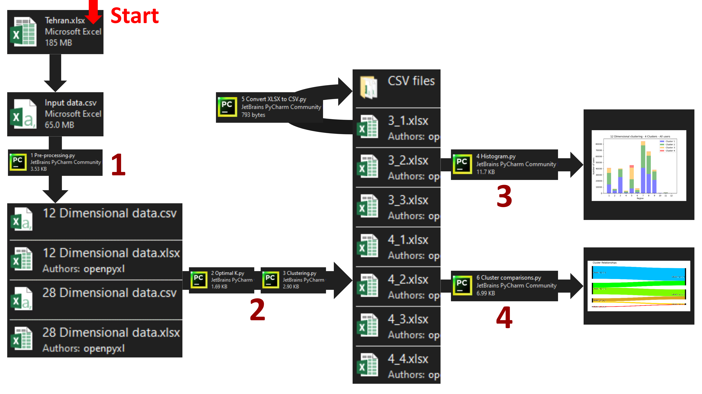

# Grouping household gas usage via Artificial Intelligence

In this project, we aim to use unsupervised machine learning algorithms to separate the household gas consumers in Tehran, Iran into different groups based on their gas usage between the years of 2007 and 2009.

Copy the contents into your ``D:\`` drive, then run the **.py** programs in ``D:\Clustering\Final\0 Code`` in numerical order while following the instructions about each program included at the end of this file. All configurable parameters in the programs can be found in the bottom of the respective body of code.

## Folder structure
Here is a quick description of the project's folder structure:

---
``D:\Clustering\Final\0 Code``
>Contains the python program files for this project. A description of what each of the programs accomplishes is given below.

``D:\Clustering\Final\1 Pre-processing data``
>Contains our raw input data (**Tehran.xlsx**), our manually pre-processed **.csv** copy of the same data (**Input data.csv**) alongside the 12 dimensional and 28 dimensional outputs of the **Pre-processing.py** program.

``D:\Clustering\Final\2 K optimization``
>Contains the Silhouette and Elbow method figures drawn with the **Optimal K.py** program. These figures were used to determine the optimal number of clusters our algorithm should aim for moving forward.

``D:\Clustering\Final\3 Output clusters``
>Contains the output clusters created by the program **Clustering.py**, Divided into two folders for the 12 dimensional clustering and the 28 dimensional clustering modes. Each cluster is written to a separate **.xlsx** file. Also includes **.csv** versions for all of the files, generated using the **Convert XLSX to CSV.py** program.

``D:\Clustering\Final\4 Histogram outputs``
>Contains the figures created by the **Histogram.py** program, sorted based on their clustering mode.

``D:\Clustering\Final\5 Cluster comparisons``
>Contains the figures created by the **Cluster comparisons.py** program.

---

## Program descriptions
Here is a brief overview of what every program does:

---
**0. Manual preprocessing**
>We take our raw input data (from the file **Tehran.xlsx**) in **.xlsx** format, then we:
>	a. Remove any user that does not have a usage code of 40 (5th row) as they do not represent household units and thus clustering them is outside the scope of this project.
>	b. Remove everything between the 4th and 11th columns (including the 4th and 11th columns themselves), as they contain no useful information for the clustering.
>	c. We write the results into the CSV file **Input data.csv**.

**1. Pre-processing.py**
>We open the CSV file **Input data.csv** and read it's contents, and divide the value of every cell (every number in columns 4 and onwards) by the "number of units" of the same row (the number saved in the 2nd column of the same row), removing the 2nd column afterwards as it is no longer useful.
>then, depending on the clustering mode (a variable assigned at the bottom of the program, which accepts values of either 12 or 28) we either:
>	a. Merge the three years of usage data into a single "average year", while correcting for the 8 missing months from the year 2008 (clustering mode of 12)
>	b. Or append the three years of usage data together to form a single continuous "28 dimensional" row of monthly gas usage values (clustering mode of 28)
>In both cases, we identify and remove all users whose usage data is missing 1 or more years.
>The program outputs the result into a **.xlsx** file, whose name is determined depending the clustering mode used during the processing (our file will either be named **12 Dimensional data.xlsx** or **28 Dimensional data.xlsx**)

**2. Optimal K.py**
>This program runs the K-means clustering algorithm on our pre-processed data, with the number of requested clusters changing between every number in the range (2, 10). Then the Silhouette method and Elbow method scores are calculated for each value of requested clusters, and figures are drawn and printed for those scores. The developers then decide the optimal number of clusters by analyzing those figures.

**3. Clustering.py**
>Receives the **X dimensional data.xlsx** file as an output from **Pre-processing.py**, then runs it through the K-means clustering algorithm, with the desired number of clusters set to the amount determined in the previous step.

**4. Histogram.py**
>Reads the output clusters from **Clustering.py**, cross references the ID of each user with the ID's of users in the original **Tehran.xlsx** file to obtain the secondary characteristics of each household (such as the number of the units in the house or apartment, the area of each unit, and the region the house is located in). Then the program draws and prints histograms that demonstrate the distribution of our test population in relation to said characteristics. Since the spread of our test population is uneven for some of the chosen characteristics, an additional normalization pass was applied over some of the figures.

**5. Convert XLSX to CSV.py**
>This program creates a **.csv** copy of every **.xlsx** file in any directory it is pointed at. Not a part of the clustering process, but used frequently throughout the project as **.csv** files are easier to read than **.xlsx**.

**6. Cluster comparisons.py**
>Reads the output clusters from **Clustering.py**, then creates Sankey diagrams that display the relations and similarities in cluster memberships when any two of our different clustering results are compared together.

---

Here's a visual representation of which files each program opens and which it outputs.

